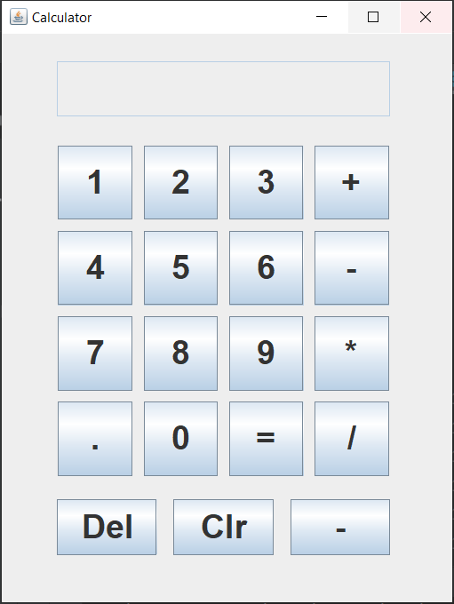

# 🧮 Calculator Application

This calculator application is designed to assist AP students in practicing problem-solving tasks.



## ✨ Features

- ➕ Basic arithmetic operations: addition, subtraction, multiplication, and division.
- 🔢 Decimal point support.
- 🧼 Clear and delete functions.
- 🔄 Ability to toggle between positive and negative numbers.

## 💻 Installation

1. **Ensure Java is Installed**: Make sure you have the Java Development Kit (JDK) installed on your computer. If not, you can download and install it from the [official Oracle website](https://www.oracle.com/java/technologies/javase-jdk11-downloads.html).
   
2. **Clone the Repository**: Download the project files by cloning the repository:

   ```bash
   git clone https://github.com/yourusername/calculator-application.git
   cd calculator-application
Compile the Code: Use the Java compiler (javac) to compile the Calculator.java file:

bash
Copy code
javac Calculator.java
🚀 Usage
Run the Application: Execute the compiled Java program:

bash
Copy code
java Calculator
User Interface:

The calculator UI displays a text field for input and buttons for numbers, arithmetic operations, and functions.
Performing Calculations:

Enter numbers using the numeric buttons.
Use the function buttons for arithmetic operations: addition (+), subtraction (-), multiplication (*), and division (/).
The decimal point button allows for entering decimal numbers.
The Clear (Clr) button clears the input field.
The Delete (Del) button removes the last digit entered.
The Negative (-) button toggles the sign of the entered number.
Pressing the equals (=) button computes the result of the operation.
Viewing Results: The result of the calculation is displayed in the text field.

🧪 Example
Addition:
Enter the first number.
Press the addition button (+).
Enter the second number.
Press the equals button (=) to see the result.
📦 Dependencies
☕ Java Development Kit (JDK)
